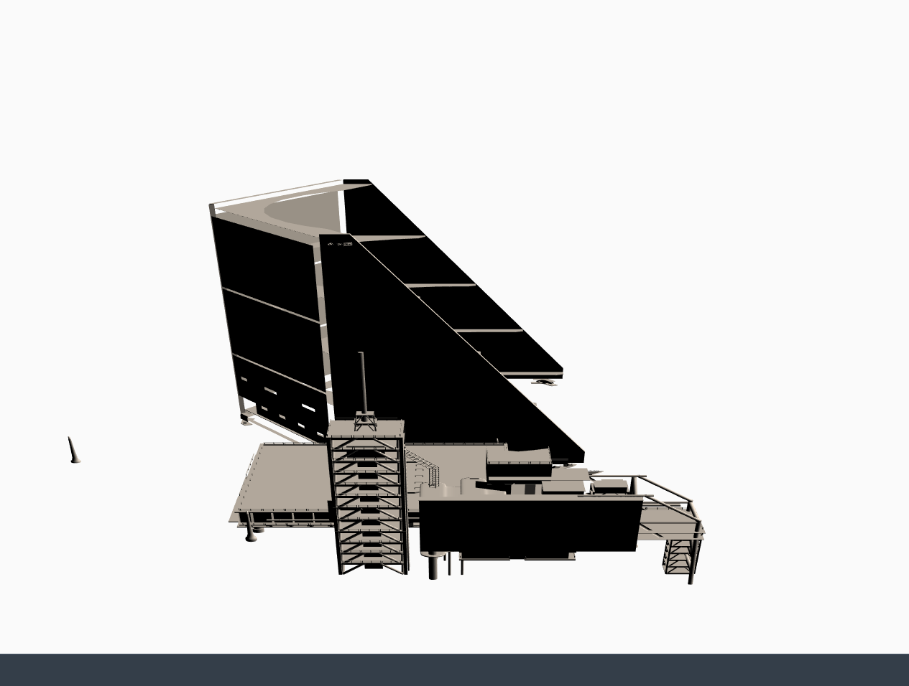

# Threejs + UI5 + custom controls
<h3> Playing around with custom controls in UI5 and the library Threejs  

#### Implementing Threejs custom controls and using them the declarative way in a xml file

  
  
    <cc:THREEScene id="threeSceneId" height="850" width="1200" alpha="true" antiAlias="true" nextFrame="handleThreeSceneNextFrame">

           <cc:objects>

                <cc:THREEObject id="threeObjectId1"
                                objFilePath="./resource/gantry.obj"
                                objPositionX="-3"
                                objPositionY="0"
                                objPositionZ="35"/>

                <cc:THREEObject id="threeObjectId2"
                                objFilePath="./resource/solararray.obj"
                                objPositionX="0"
                                objPositionY="-25"
                                objPositionZ="0"/>

            </cc:objects>

            <cc:camera>
                
                <cc:THREEPerspectiveCamera cameraPositionY="40" cameraPositionX="0" cameraPositionZ="80" />
                
            </cc:camera>
            <cc:directionalLight>

                <cc:THREEDirectionalLight position1Of3DVector="1" position2Of3DVector="1" position3Of3DVector="0"/>

            </cc:directionalLight>
            <cc:ambientLight>

                <cc:THREEAmbientLight color="0x101030" />

            </cc:ambientLight>
        </cc:THREEScene>

